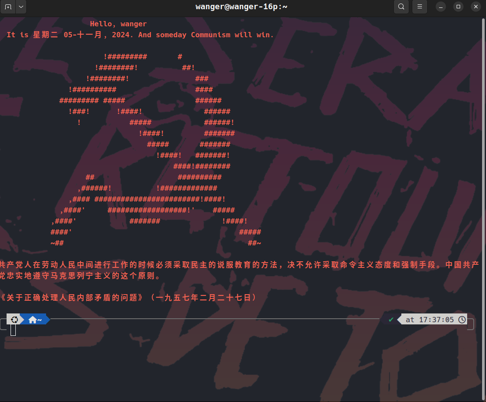

# Communism



一个 zsh 启动插件，在终端上展示图像与主席语录

### 需要

- oh-my-zsh

### 安装方法

```shell
cd ~/{你的oh-my-zsh插件存放目录}
git clone --depth-1 https://github.com/victoria-riley-barnett/Communism
```

在`.zshrc`中的 plugins 数组添加:

```shell
plugins=(... Communism)
```
